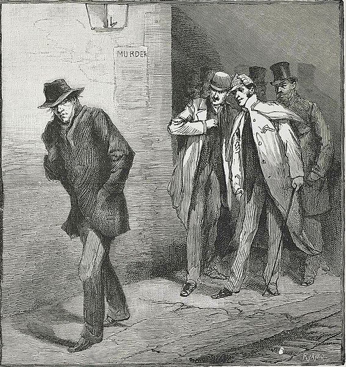

<!-- ADD IMAGES I GUESS -->

# Who was Jack the Ripper?

Jack the ripper was a serial killer whose identity, until today, still have not been known. He was known for murders of at least five women in London, particularly near the Whitechapel district, between August and November 1888.

Multiple cases of murders have been reported between 1888 and 1892 that have been pointed to Jack the Ripper. However, only five of those, the _canonical five_, were linked by the police to the same culprit.

<figure>

<figcaption align="center">Newspaper Illustration depicting Jack the Ripper</figcaption>
</figure>

::: info
Jack the Ripper was also previously called _The Whitechapel Murderer_, _Leather Apron_, and _The Red Fiend_.
:::

::: warning Note
While Jack the Ripper's identity is still unknown, in the following articles we used the pronouns that Jack the Ripper was commonly attributed by, which are **he** and **him**.
:::

## The Canonical Five

The Women Killed identified by the police to be the victim of the same murderer are the following:

1. **Mary Ann Nichols**
   (found on August 31, 1888)

2. **Annie Chapman**
   (found September 8, 1888)

3. **Elizabeth Stride**
   (found September 30, 1888)

4. **Catherine Eddowes**
   (found September 30. 1888)

5. **Mary Jane Kelly**
   (found November 9, 1888)

## "Dear Boss" Letter

The "Dear Boss" letter is one of the key evidences associated to Jack the Ripper. It was sent to the Central News Agency in London on September 27, 1888. The letter overall was evidently just to mock the investigations regarding the serial killings and to give hints to future murders. However, this letter is regarded as the first piece of evidence linking to the identity of a killer known as Jack the Ripper.

::: info
You can read the letter [here](https://umsi580.lsait.lsa.umich.edu/s/stand_up_be_counted/item/1105).
:::

## References

1. Jenkins, J. P., & The Editors of Encyclopaedia Britannica. (2024, May 6). _Jack the Ripper_. In Encyclopaedia Britannica. Retrieved from https://www.britannica.com/biography/Jack-the-Ripper
