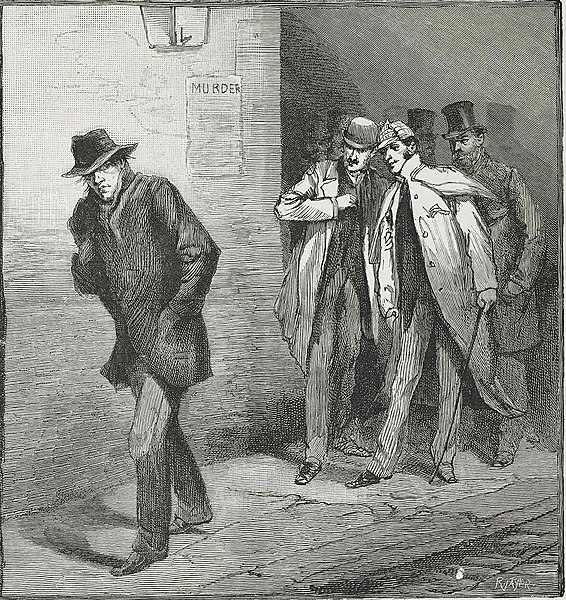
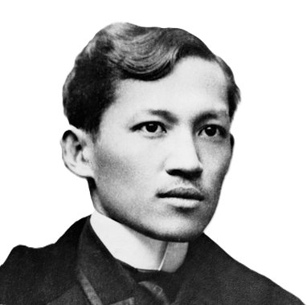

# Jack the Ripper Conspiracy

Jack the ripper was a serial killer whose identity, until today, still have not been known. He was known for murders of at least five women in London, particularly near the Whitechapel district, between August and November 1888. It intrigued some people (mostly Filipinos) because Jose Rizal was also in London during those times. Moreover, people speculated that the unidentified killer was Jose Rizal for a number of coincidences.

<figure>

<figcaption align="center">Newspaper Illustration depicting Jack the Ripper</figcaption>
</figure>

<figure>

<figcaption align="center">Jose Rizal</figcaption>
</figure>

## Evidence

Rizal was one of the suspected persons to be Jack the Ripper for a number of coincidences.

1. Timeline and Location Coincidence
   ::: info Jose Rizal in London
   Jose Rizal was also in London from May 1888 to January 1889 using the British library facilities. By the time Jose Rizal left London, the killings stopped.
   :::

2. Medicinal Knowledge of Rizal
   ::: info Medicinal Knowledge of Rizal
   Jose Rizal was knowledgable of medical practices. He was a doctor.
   :::

3. Mysterious Aspects of Rizal's Life
   ::: info
   Rizal was a polymath. He was good at fencing, proficient in the martial arts, and good with swords.
   :::

4. Their Initials Matched
   ::: info J.R. Initials
   Jack the Ripper and Jose Rizal both had the same initials, J.R..
   :::

## Debunking

The pieces of evidence presented were not possible for the following reasons.

1. Lack of Direct Evidence
2. Difference in Their Characteristics
3. Difference in Their Personality Profiles
4. Historical Documentation

<!-- ## References

1. lorem ipsum (2018). _lorem ipsum title_. Publisher. Retrieved [url](https://google.com)

[text](https://www.tsikot.com/forums/miscellaneous-talk-163/jose-rizal-jack-ripper-42421/)

https://www.esquiremag.ph/culture/books-and-art/sherlock-holmes-meets-jose-rizal-jack-the-ripper-a00289-20201010-lfrm -->
